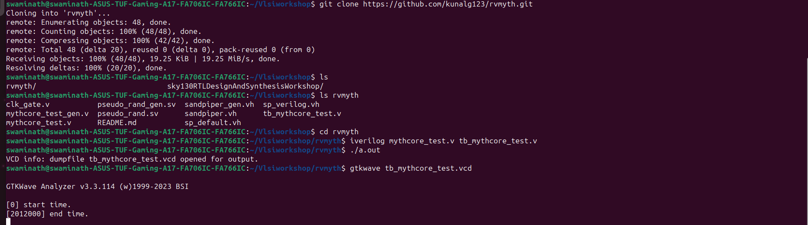
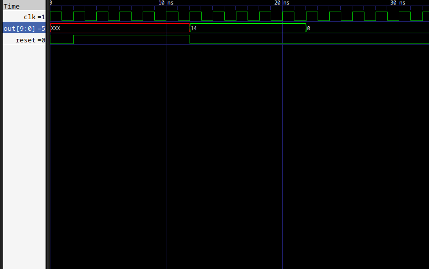
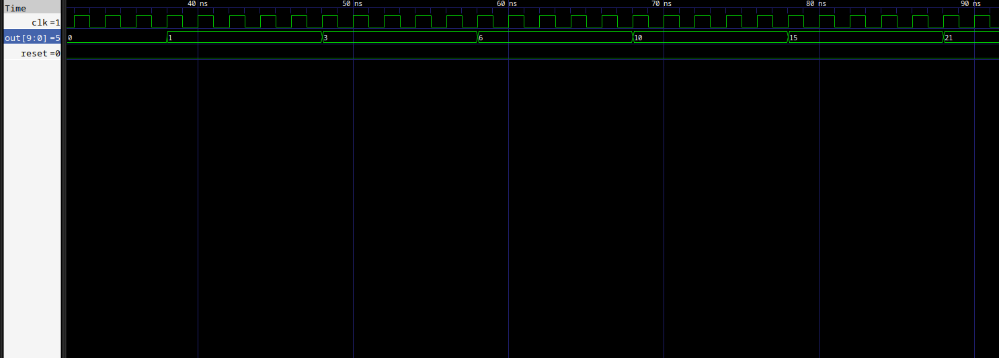
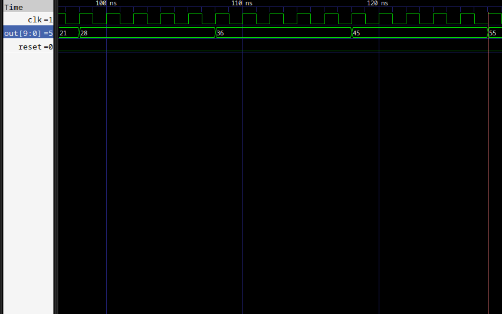

# swaminath-vsd


<details>
<summary><b>Day 0</b></summary>

## Day 0 - Tools Installation

### Yosys

Installation from source for the latest version. This method ensures you have the most up-to-date features.

```bash
$ git clone https://github.com/YosysHQ/yosys.git
$ cd yosys
$ sudo apt install make
$ sudo apt-get install build-essential clang bison flex \
    libreadline-dev gawk tcl-dev libffi-dev git \
    graphviz xdot pkg-config python3 libboost-system-dev \
    libboost-python-dev libboost-filesystem-dev zlib1g-dev
$ make
$ sudo make install
```

### Yosys Output


### Yosys Tool 


### Icarus Verilog

Simple installation using the standard package manager.

```bash
$ sudo apt-get install iverilog
```

### Icarus Verilog installation


### Icarus Verilog Tool


### GTKWave

Installation using the standard package manager.

```bash
$ sudo apt update
$ sudo apt install gtkwave
```

### GTK Waveform Installation


### GTK Waveform Tool 


</details>


<details>

<summary><b>Week 1 Overview</b></summary>

## Week 1 - Introduction to Verilog RTL Design and Synthesis

Week 1 focuses on the fundamentals of digital design using Verilog HDL, covering simulation, synthesis, and optimization techniques. Students will learn to use industry-standard tools for RTL design and verification.

### Week 1 Learning Objectives:
- Master Verilog simulation using Iverilog and GTKWave
- Understand synthesis process using Yosys
- Learn library characterization and timing analysis
- Explore hierarchical vs flat synthesis methodologies
- Implement various flip-flop coding styles
- Apply logic optimization techniques

<details>
<summary><b>Day 1 - Introduction to Verilog RTL Design and Synthesis</b></summary>

### Introduction to Iverilog Design Testbench

This section introduces the fundamental concepts of Verilog simulation, testbench design, and the simulation flow using open-source tools.

**Key Concepts:**
- RTL Design and Testbench relationship
- Simulator working methodology
- Design setup and verification flow


---

#### Lab 1: Introduction to Lab

**Objective:** Understanding the lab environment and tool setup for Verilog design simulation.

**Topics Covered:**
- Lab directory structure exploration
- File organization for designs and testbenches
- Introduction to design flow methodology 


**Lab Environment Setup:**
- Cloning verilog files repository

- Understanding lib, verilog_model, and verilog_files directories
- File naming conventions and organization
-Lab using yosys 
 example used here is of a mux 


</details>
<details>
<summary><b>Day-2 Timing libs,Hierarchy vs flat Synthesis </b></summary>

Timing libraries, typically in the Liberty (.lib) format, are essential for digital design as they provide characterization data like timing, area, and power for standard cells under various operating and process conditions. These libraries use models such as NLDM (Non-Linear Delay Model) and CCS (Composite Current Source), where CCS offers improved accuracy but at a larger file size and complexity compared to NLDM. Timing libraries form the backbone for static timing analysis and synthesis stages, guiding the EDA tools in optimizing and verifying timing closure.

When it comes to synthesis strategies, hierarchical and flat synthesis differ in their approach to design optimization. Hierarchical synthesis maintains the modular structure of a design, optimizing each block or module independently, which allows for design reuse, faster synthesis times, and easier debugging and constraint management. However, this can lead to suboptimal global optimization, as cross-module paths may not be fully optimized. In contrast, flat synthesis collapses the hierarchy, treating the entire design as a single entity for synthesis. This enables stronger global optimization and potentially better area and timing results, but at the cost of increased tool runtime, memory requirements, and loss of modularity, making later debugging and incremental changes more challenging. The choice between these methods often depends on the size and complexity of the design, as well as the importance of optimization versus maintainability.

Here are the few lab programs which where simulated , synthesised and netlist where created 

# Hiearchy Example

# Flatten example

# Output 

Flop Coding Styles and Optimization

Flip-flop coding styles significantly impact synthesis results and overall design performance. Synchronous reset flops are preferred for FPGA implementations as they utilize dedicated reset resources efficiently and provide better timing predictability. The reset logic is embedded within the clock domain, making timing closure easier. Asynchronous reset flops offer faster reset response but can create timing challenges and may consume additional routing resources.

Clock enable coding styles allow selective updating of flip-flops, reducing power consumption by preventing unnecessary transitions. Proper clock enable implementation prevents clock gating synthesis issues and maintains design synchronization. Multi-bit flop coding involves grouping related signals into vector registers, enabling synthesis tools to implement more efficient multi-bit flip-flop cells, reducing area and improving performance.

Optimization techniques include avoiding mixed reset types within modules, as this can prevent inference of optimal flop implementations. Using reset synchronizers for asynchronous reset deassertion ensures glitch-free operation. Pipeline register insertion at module boundaries improves timing by breaking long combinational paths. Synthesis tools can optimize flop placement and clustering when consistent coding styles are maintained. Load balancing through register duplication helps meet timing requirements in high-fanout scenarios, while retiming optimization can redistribute registers across combinational logic to achieve better frequency targets.
Here is the example which was done in the lab 
# dff asyncr Gtk waves

# synthesis Example

# netlist example

# Output 

Synthesizing of flops 
Here are the results of the above topic done in lab 
Synthesizing mult2 (multiply by 2)
# Code

# Output 

</details>
<details>
<summary><b>Day 3 -  Combinational and Sequential Optimizations</b></summary>
Combinational optimization focuses on reducing delay, area, and power in logic gates without memory elements. Boolean minimization techniques like Karnaugh maps and Quine-McCluskey method eliminate redundant logic terms. Multi-level optimization restructures logic networks through factorization, decomposition, and common sub-expression elimination to reduce gate count and critical path delays. Technology mapping selects optimal standard cells from libraries, considering area-delay trade-offs. Logic sharing identifies common logic patterns across different paths, reducing total gate count while maintaining functionality.

Sequential optimization targets circuits with memory elements like flip-flops and latches. Retiming is a powerful technique that repositions registers across combinational logic boundaries without altering functionality, enabling better timing performance by balancing pipeline stages. This optimization can reduce clock period by moving registers from low-delay paths to critical paths.
# Logic Implementation
Only AND gate was used 

# Optimization

# Optimizing DFF cont3

# Optimizing DFF cont2

</details>
<details>
<summary><b>Day 4 - GLS, Blocking vs Non-blocking and Synthesis-Simulation Mismatch</b></summary>
Gate Level Simulation (GLS) verifies design functionality after synthesis using the actual gate-level netlist with real timing delays from Standard Delay Format (SDF) files. Unlike RTL simulation, GLS provides accurate timing verification, detects glitches and race conditions, and validates asynchronous paths that static timing analysis might miss. GLS is essential for catching synthesis errors, verifying scan chain implementation, and ensuring proper system initialization and reset behavior.

Blocking vs Non-blocking assignments fundamentally differ in execution behavior. Blocking assignments (=) execute sequentially within an always block, with each statement completing before the next begins. This creates combinational logic where changes propagate immediately. Non-blocking assignments (<=) schedule updates that occur simultaneously at the end of the time step, modeling sequential logic behavior more accurately. The key difference: blocking creates a shift register effect in one clock cycle, while non-blocking creates proper pipeline behavior across multiple cycles.

Synthesis-Simulation Mismatch occurs when RTL and post-synthesis simulations produce different results. Common causes include improper mixing of blocking and non-blocking assignments within the same always block, incomplete sensitivity lists, uninitialized signals, and poor clock domain crossing practices. Race conditions from blocking assignments can synthesize differently than simulated, while latch inference from incomplete conditional statements creates unexpected behavior. Timing violations and metastability issues appear only in GLS with realistic delays. Prevention requires consistent coding styles, proper reset initialization, and comprehensive testbenches that verify both functional and timing aspects
# Ternary operation mux


# Blocking example 


</details>
<details>
<summary><b>Day 5 - IF statements ,incomplete and  bad cases</b></summary>
Incomplete IF statements are a major source of unintentional latch inference in combinational logic. When an IF statement lacks an ELSE clause or doesn't assign values to all outputs in every branch, synthesis tools must preserve the previous value, creating transparent latches. For example, if a signal is assigned only when a condition is true but has no assignment when false, the synthesizer infers a latch to "remember" the last value. This behavior is rarely intended in digital design and leads to timing complexities since latches are level-sensitive rather than edge-sensitive.

Bad coding practices include mixing blocking and non-blocking assignments within the same always block, creating incomplete sensitivity lists that don't include all referenced signals, and writing nested IF-ELSE chains when mutually exclusive conditions could use CASE statements instead. Priority encoding results from IF-ELSIF chains, creating cascaded multiplexers with unequal path delays, whereas parallel CASE statements synthesize to balanced multiplexer structures with uniform timing.
# Using IF incomplete Statements


# Using IF incomplete Statements type2 


# Bad cases 


# Partial Example 

</details>
</details>
<details>
<summary><b>Week 2 Overview</b></summary>
<details>
<summary><b>Baby Soc introduction and details  </b></summary>

## Introduction

System-on-Chip (SoC) design represents the pinnacle of modern semiconductor engineering, integrating an entire computer system onto a single integrated circuit . This comprehensive approach to hardware design has revolutionized electronics, enabling everything from smartphones to IoT devices to operate with unprecedented efficiency and compactness. This write-up explores the fundamental concepts of SoC design and demonstrates how BabySoC serves as an ideal educational model for understanding these complex systems.

---

## What is a System-on-Chip (SoC)?

A System-on-Chip (SoC) is an integrated circuit that contains all the components of a complete computer system on a single chip. Unlike traditional system designs where components like processors, memory, and peripherals are separate chips connected via external buses, an SoC integrates these functions into one unified package. This integration significantly enhances performance, reduces power consumption, and minimizes the physical footprint of electronic devices.

The fundamental advantage of SoC architecture lies in its ability to eliminate the performance bottlenecks and power inefficiencies associated with inter-chip communication . By placing all system components on the same silicon die, data transfer speeds increase dramatically while power consumption decreases, making SoCs ideal for battery-powered and space-constrained applications.

---

## Components of a Typical SoC

### Processing Cores

The heart of any SoC is its processing unit, which can include microprocessors, microcontrollers, or Digital Signal Processors (DSPs). Modern SoCs often incorporate multiple CPU cores, including application processors (such as ARM Cortex or RISC-V cores) and specialized processors for specific tasks. These cores handle everything from general-purpose computing to real-time control functions .

### Memory Subsystem

SoC memory architecture typically includes multiple types of storage: volatile memory (SRAM and DRAM), non-volatile memory (ROM and Flash), and cache memory. The memory hierarchy is carefully designed to balance performance, power consumption, and cost, with high-speed cache memory providing rapid access to frequently used data while larger, slower memory stores the bulk of system information .

### Interconnect Infrastructure

The system interconnect serves as the communication backbone of the SoC, connecting all components through sophisticated on-chip networks . Modern SoCs employ advanced interconnect architectures like Network-on-Chip (NoC) implementations, which provide high-bandwidth, low-latency communication between system components while supporting features like quality-of-service (QoS) management and security firewalls .

### Peripheral and I/O Interfaces

SoCs integrate numerous peripheral controllers and I/O interfaces, including USB, SPI, I2C, UART, Ethernet, and wireless communication modules (Wi-Fi, Bluetooth) . These components enable the SoC to communicate with external devices and sensors, making it suitable for a wide range of applications from embedded systems to high-performance computing platforms.

### Specialized Hardware Accelerators

Many modern SoCs include dedicated hardware accelerators for specific functions such as graphics processing (GPUs), cryptographic operations, digital signal processing, and artificial intelligence workloads . These accelerators provide significant performance and power efficiency improvements over software-based implementations .

---

## The SoC Design Flow: From Concept to Silicon

### Architectural Design and Specification

The SoC design process begins with detailed specification and architectural design, where engineers define the system's functionality, performance requirements, power constraints, and interface specifications . This phase establishes the foundation for all subsequent design activities and determines the overall system architecture .

### Functional Modeling and High-Level Design

Before proceeding to detailed RTL implementation, engineers create high-level functional models using languages like C, SystemC, or specialized modeling tools . These models enable early software development, system-level optimization, and architectural validation without the complexity of low-level hardware details .

### RTL Design and Implementation

The Register Transfer Level (RTL) design phase translates the high-level architecture into detailed hardware descriptions using Hardware Description Languages (HDLs) like Verilog or VHDL . RTL design specifies the exact behavior of digital circuits, including data paths, control logic, and timing relationships .

### Verification and Validation

Functional verification ensures that the RTL implementation correctly matches the specification through extensive simulation, formal verification, and emulation. This critical phase identifies and resolves design bugs before proceeding to physical implementation, as errors found later in the design flow are exponentially more expensive to fix .

### Physical Design and Implementation

The physical design phase transforms the verified RTL into a manufacturable layout through synthesis, floorplanning, placement, routing, and timing optimization . This backend process ensures that the design meets performance, power, and area targets while being manufacturable using specific semiconductor process technologies.

---

## Why BabySoC is a Simplified Model for Learning

### Educational Focus and Accessibility

VSDBabySoC represents an ideal educational platform for understanding SoC design principles. As a small yet complete RISC-V based SoC, it demonstrates all fundamental SoC concepts while remaining simple enough for students to comprehend and experiment with. The design integrates three key IP cores: a RVMYTH RISC-V processor, an 8x Phase-Locked Loop (PLL) for clock generation, and a 10-bit Digital-to-Analog Converter (DAC) for interfacing with analog systems.

### Open-Source Learning Environment

BabySoC leverages open-source tools and methodologies, making it accessible to students and educators worldwide. The design uses industry-standard tools like Icarus Verilog for simulation and GTKWave for waveform analysis, providing students with hands-on experience using professional-grade development environments without licensing restrictions.

### Complete System Integration

Despite its simplicity, BabySoC demonstrates complete system integration, showing how different IP blocks communicate and work together to create a functional system . Students can observe how the PLL generates stable clock signals, how the RISC-V processor executes instructions, and how the DAC interfaces with external analog devices, providing a holistic view of SoC operation.

### Real-World Application Context

The BabySoC design, fabricated using Sky130 technology, bridges the gap between academic learning and industrial practice . Students working with BabySoC gain experience with the same design methodologies, verification techniques, and implementation flows used in commercial SoC development, preparing them for careers in the semiconductor industry .

---

## The Role of Functional Modeling in SoC Design

### Early Design Validation

Functional modeling plays a crucial role in SoC design by enabling early validation of system behavior before detailed RTL implementation . High-level models allow designers to explore different architectural options, validate system-level functionality, and identify potential design issues while changes are still relatively inexpensive to implement.

### Software Development Enablement

Functional models provide a platform for early software development, allowing software teams to begin work on drivers, firmware, and applications before hardware is available . This parallel development approach significantly reduces overall project timelines and enables better hardware-software co-optimization .

### System-Level Performance Analysis

Functional models enable system-level performance analysis and optimization, allowing designers to evaluate different architectural trade-offs and identify potential bottlenecks . These models can simulate complex scenarios and workloads that would be impractical to test on actual hardware during early design phases.

### Verification Planning and Coverage Analysis

Functional modeling supports comprehensive verification planning by helping identify test scenarios, coverage metrics, and verification strategies. The models serve as golden references for RTL verification, ensuring that the detailed implementation maintains the intended system behavior.

---

## Conclusion

System-on-Chip design represents one of the most challenging and rewarding areas of modern engineering, requiring deep understanding of computer architecture, digital design, and physical implementation . The design flow from architectural specification through functional modeling to RTL implementation and physical design demonstrates the complexity and sophistication required for successful SoC development .

BabySoC serves as an excellent educational vehicle for understanding these concepts, providing students with hands-on experience in SoC design, verification, and implementation using industry-standard tools and methodologies . By working with BabySoC, students gain practical experience with the complete SoC design flow while building the foundational knowledge necessary for advanced work in VLSI design and semiconductor engineering.

The role of functional modeling in this process cannot be overstated – it provides the critical bridge between high-level system requirements and detailed hardware implementation, enabling early validation, software development, and system optimization . As SoC designs continue to grow in complexity, the importance of robust functional modeling and systematic design flows will only increase, making educational platforms like BabySoC even more valuable for preparing the next generation of semiconductor engineers.

---

</details>
<details>
<summary><b>Baby Soc example iverilog execution and GTKwave analysis </b></summary>

## Baby Soc Overview

This code implements a basic System-on-Chip (SoC) containing a RISC-V processor core capable of executing RV32I instruction set. The design includes instruction memory, register file, data memory, and ALU components integrated into a functional CPU core.

## Features

- **Complete RV32I Support**: Implements all base integer instructions
- **5-Stage Pipeline**: Fetch, Decode, Execute, Memory, Writeback
- **Integrated Components**:
  - 32-entry Register File
  - 16-word Data Memory
  - 12-instruction Program Memory
  - Branch prediction and jump handling
- **Test Program**: Sum calculation (1+2+3+...+9 = 45)
### Simulation Steps

## Simulation Results

### Test Program Execution
The core successfully executes a sum program that calculates 1+2+3+...+9 = 45.

**Expected Behavior:**
- Initialize sum register to 0
- Loop through numbers 1-9
- Accumulate sum in register r14
- Output final result (45) through `out[9:0]` port

### Waveform Analysis

#### Reset Operation


The reset sequence shows proper initialization of all registers and control signals. The core remains in reset state until the reset signal is deasserted, after which normal operation begins.

#### Program Execution


This waveform demonstrates the program counter incrementing sequentially through the instruction memory, executing the sum calculation algorithm. Each clock cycle advances the PC by 4 bytes (32-bit instruction width).

#### Final Result Verification


The output port `out[9:0]` displays the final calculated sum of 45, confirming correct program execution and register file operation.


