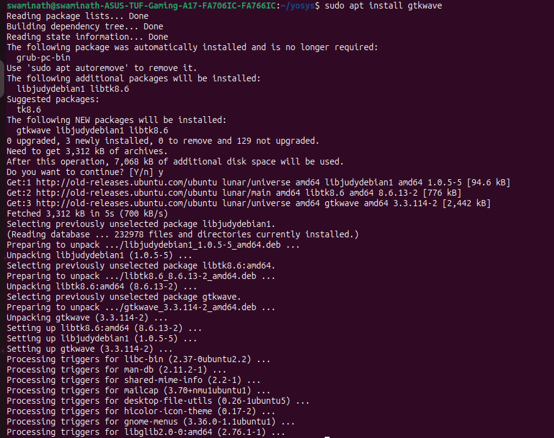

# swaminath-vsd

## Day 0 - Tools Installation

### Yosys

Installation from source for the latest version. This method ensures you have the most up-to-date features.

```bash
$ git clone https://github.com/YosysHQ/yosys.git
$ cd yosys
$ sudo apt install make
$ sudo apt-get install build-essential clang bison flex \
    libreadline-dev gawk tcl-dev libffi-dev git \
    graphviz xdot pkg-config python3 libboost-system-dev \
    libboost-python-dev libboost-filesystem-dev zlib1g-dev
$ make
$ sudo make install
```

### Yosys Output


### Yosys Tool 


### Icarus Verilog

Simple installation using the standard package manager.

```bash
$ sudo apt-get install iverilog
```

### Icarus Verilog installation


### Icarus Verilog Tool


### GTKWave

Installation using the standard package manager.

```bash
$ sudo apt update
$ sudo apt install gtkwave
```

### GTK Waveform Installation


### GTK Waveform Tool 
