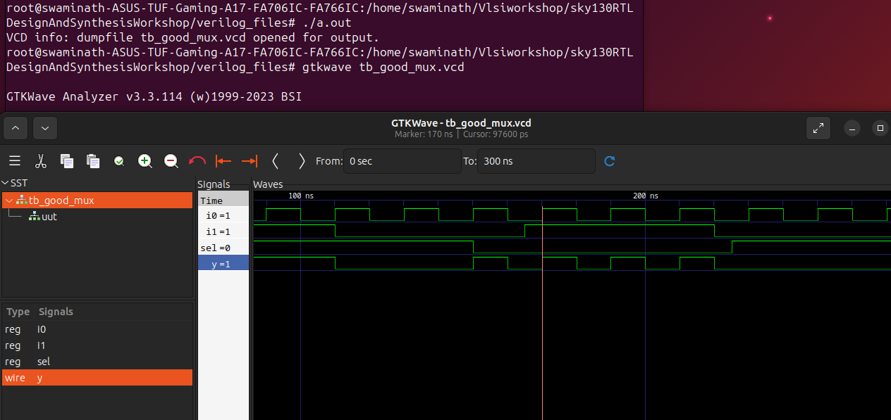
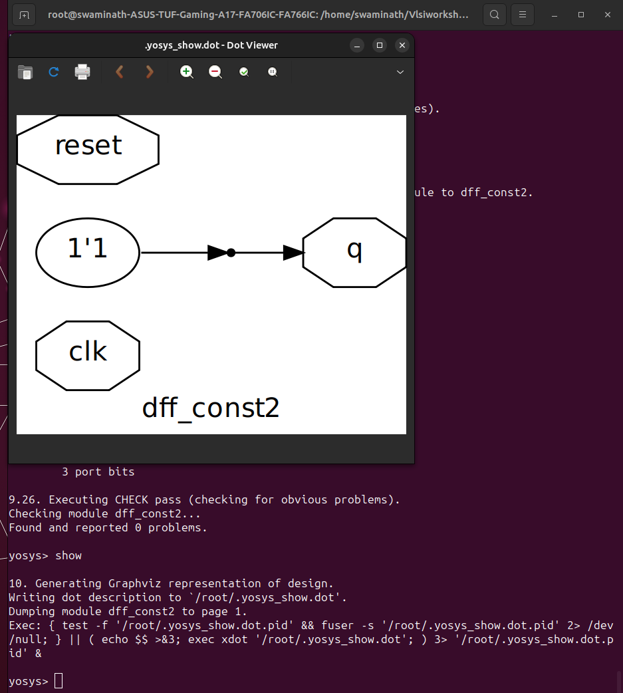

# swaminath-vsd


<details>
<summary><b>Day 0</b></summary>

## Day 0 - Tools Installation

### Yosys

Installation from source for the latest version. This method ensures you have the most up-to-date features.

```bash
$ git clone https://github.com/YosysHQ/yosys.git
$ cd yosys
$ sudo apt install make
$ sudo apt-get install build-essential clang bison flex \
    libreadline-dev gawk tcl-dev libffi-dev git \
    graphviz xdot pkg-config python3 libboost-system-dev \
    libboost-python-dev libboost-filesystem-dev zlib1g-dev
$ make
$ sudo make install
```

### Yosys Output


### Yosys Tool 


### Icarus Verilog

Simple installation using the standard package manager.

```bash
$ sudo apt-get install iverilog
```

### Icarus Verilog installation


### Icarus Verilog Tool


### GTKWave

Installation using the standard package manager.

```bash
$ sudo apt update
$ sudo apt install gtkwave
```

### GTK Waveform Installation


### GTK Waveform Tool 


</details>


<details>

<summary><b>Week 1 Overview</b></summary>

## Week 1 - Introduction to Verilog RTL Design and Synthesis

Week 1 focuses on the fundamentals of digital design using Verilog HDL, covering simulation, synthesis, and optimization techniques. Students will learn to use industry-standard tools for RTL design and verification.

### Week 1 Learning Objectives:
- Master Verilog simulation using Iverilog and GTKWave
- Understand synthesis process using Yosys
- Learn library characterization and timing analysis
- Explore hierarchical vs flat synthesis methodologies
- Implement various flip-flop coding styles
- Apply logic optimization techniques

<details>
<summary><b>Day 1 - Introduction to Verilog RTL Design and Synthesis</b></summary>

### Introduction to Iverilog Design Testbench

This section introduces the fundamental concepts of Verilog simulation, testbench design, and the simulation flow using open-source tools.

**Key Concepts:**
- RTL Design and Testbench relationship
- Simulator working methodology
- Design setup and verification flow


---

#### Lab 1: Introduction to Lab

**Objective:** Understanding the lab environment and tool setup for Verilog design simulation.

**Topics Covered:**
- Lab directory structure exploration
- File organization for designs and testbenches
- Introduction to design flow methodology 


**Lab Environment Setup:**
- Cloning verilog files repository

- Understanding lib, verilog_model, and verilog_files directories
- File naming conventions and organization
-Lab using yosys 
 example used here is of a mux 




</details>
<details>
<summary><b>Day-2 Timing libs,Hierarchy vs flat Synthesis </b></summary>

Timing libraries, typically in the Liberty (.lib) format, are essential for digital design as they provide characterization data like timing, area, and power for standard cells under various operating and process conditions. These libraries use models such as NLDM (Non-Linear Delay Model) and CCS (Composite Current Source), where CCS offers improved accuracy but at a larger file size and complexity compared to NLDM. Timing libraries form the backbone for static timing analysis and synthesis stages, guiding the EDA tools in optimizing and verifying timing closure.

When it comes to synthesis strategies, hierarchical and flat synthesis differ in their approach to design optimization. Hierarchical synthesis maintains the modular structure of a design, optimizing each block or module independently, which allows for design reuse, faster synthesis times, and easier debugging and constraint management. However, this can lead to suboptimal global optimization, as cross-module paths may not be fully optimized. In contrast, flat synthesis collapses the hierarchy, treating the entire design as a single entity for synthesis. This enables stronger global optimization and potentially better area and timing results, but at the cost of increased tool runtime, memory requirements, and loss of modularity, making later debugging and incremental changes more challenging. The choice between these methods often depends on the size and complexity of the design, as well as the importance of optimization versus maintainability.

Here are the few lab programs which where simulated , synthesised and netlist where created 

# Hiearchy Example

# Flatten example

# Output 

Flop Coding Styles and Optimization

Flip-flop coding styles significantly impact synthesis results and overall design performance. Synchronous reset flops are preferred for FPGA implementations as they utilize dedicated reset resources efficiently and provide better timing predictability. The reset logic is embedded within the clock domain, making timing closure easier. Asynchronous reset flops offer faster reset response but can create timing challenges and may consume additional routing resources.

Clock enable coding styles allow selective updating of flip-flops, reducing power consumption by preventing unnecessary transitions. Proper clock enable implementation prevents clock gating synthesis issues and maintains design synchronization. Multi-bit flop coding involves grouping related signals into vector registers, enabling synthesis tools to implement more efficient multi-bit flip-flop cells, reducing area and improving performance.

Optimization techniques include avoiding mixed reset types within modules, as this can prevent inference of optimal flop implementations. Using reset synchronizers for asynchronous reset deassertion ensures glitch-free operation. Pipeline register insertion at module boundaries improves timing by breaking long combinational paths. Synthesis tools can optimize flop placement and clustering when consistent coding styles are maintained. Load balancing through register duplication helps meet timing requirements in high-fanout scenarios, while retiming optimization can redistribute registers across combinational logic to achieve better frequency targets.
Here is the example which was done in the lab 
# dff asyncr Gtk waves

# synthesis Example

# netlist example

# Output 

Synthesizing of flops 
Here are the results of the above topic done in lab 
Synthesizing mult2 (multiply by 2)
# Code

# Output 

</details>
<details>
<summary><b>Day 3 -  Combinational and Sequential Optimizations</b></summary>
Combinational optimization focuses on reducing delay, area, and power in logic gates without memory elements. Boolean minimization techniques like Karnaugh maps and Quine-McCluskey method eliminate redundant logic terms. Multi-level optimization restructures logic networks through factorization, decomposition, and common sub-expression elimination to reduce gate count and critical path delays. Technology mapping selects optimal standard cells from libraries, considering area-delay trade-offs. Logic sharing identifies common logic patterns across different paths, reducing total gate count while maintaining functionality.

Sequential optimization targets circuits with memory elements like flip-flops and latches. Retiming is a powerful technique that repositions registers across combinational logic boundaries without altering functionality, enabling better timing performance by balancing pipeline stages. This optimization can reduce clock period by moving registers from low-delay paths to critical paths.
# Logic Implementation
Only AND gate was used 

# Optimization

# Optimizing DFF cont3

# Optimizing DFF cont2

</details>
<details>
<summary><b>Day 4 - GLS, Blocking vs Non-blocking and Synthesis-Simulation Mismatch</b></summary>
Gate Level Simulation (GLS) verifies design functionality after synthesis using the actual gate-level netlist with real timing delays from Standard Delay Format (SDF) files. Unlike RTL simulation, GLS provides accurate timing verification, detects glitches and race conditions, and validates asynchronous paths that static timing analysis might miss. GLS is essential for catching synthesis errors, verifying scan chain implementation, and ensuring proper system initialization and reset behavior.

Blocking vs Non-blocking assignments fundamentally differ in execution behavior. Blocking assignments (=) execute sequentially within an always block, with each statement completing before the next begins. This creates combinational logic where changes propagate immediately. Non-blocking assignments (<=) schedule updates that occur simultaneously at the end of the time step, modeling sequential logic behavior more accurately. The key difference: blocking creates a shift register effect in one clock cycle, while non-blocking creates proper pipeline behavior across multiple cycles.

Synthesis-Simulation Mismatch occurs when RTL and post-synthesis simulations produce different results. Common causes include improper mixing of blocking and non-blocking assignments within the same always block, incomplete sensitivity lists, uninitialized signals, and poor clock domain crossing practices. Race conditions from blocking assignments can synthesize differently than simulated, while latch inference from incomplete conditional statements creates unexpected behavior. Timing violations and metastability issues appear only in GLS with realistic delays. Prevention requires consistent coding styles, proper reset initialization, and comprehensive testbenches that verify both functional and timing aspects
# Ternary operation mux


# Blocking example 


</details>
<details>
<summary><b>Day 5 - IF statements ,incomplete and  bad cases</b></summary>
Incomplete IF statements are a major source of unintentional latch inference in combinational logic. When an IF statement lacks an ELSE clause or doesn't assign values to all outputs in every branch, synthesis tools must preserve the previous value, creating transparent latches. For example, if a signal is assigned only when a condition is true but has no assignment when false, the synthesizer infers a latch to "remember" the last value. This behavior is rarely intended in digital design and leads to timing complexities since latches are level-sensitive rather than edge-sensitive.

Bad coding practices include mixing blocking and non-blocking assignments within the same always block, creating incomplete sensitivity lists that don't include all referenced signals, and writing nested IF-ELSE chains when mutually exclusive conditions could use CASE statements instead. Priority encoding results from IF-ELSIF chains, creating cascaded multiplexers with unequal path delays, whereas parallel CASE statements synthesize to balanced multiplexer structures with uniform timing.
# Using IF incomplete Statements


# Using IF incomplete Statements type2 


# Bad cases 


# Partial Example 

</details>


